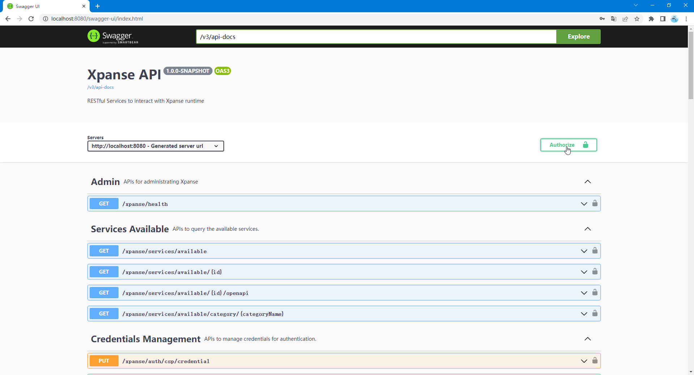
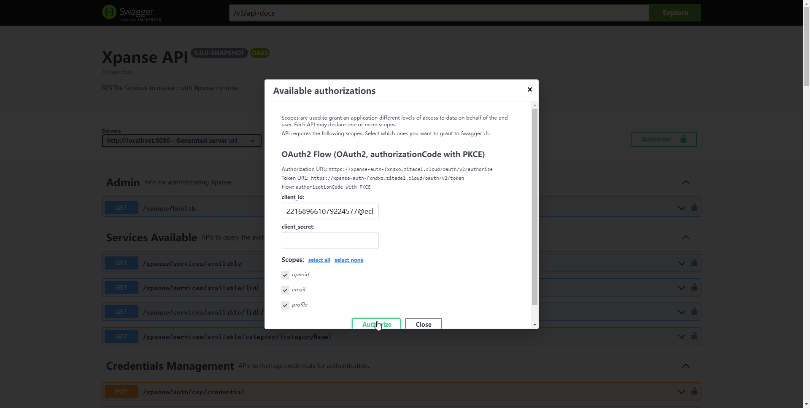
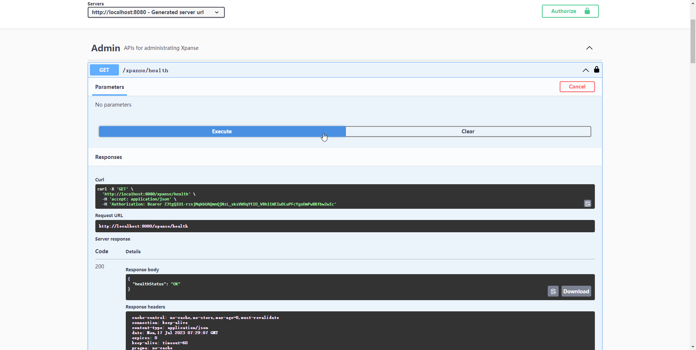
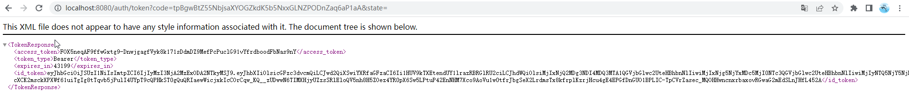

<p align='center'>
<a href="https://github.com/eclipse-xpanse/xpanse/actions/workflows/ci.yml" target="_blank">
    
</a>

 <a href="https://github.com/eclipse-xpanse/xpanse/actions/workflows/coverage.yml" target="_blank">
    
  </a>

<a href="https://opensource.org/licenses/Apache-2.0" target="_blank">
    
  </a>
</p>

Xpanse is an Open Source project allowing to easily implement native managed service on any cloud service provider. This
project is part of the Open Services Cloud (OSC) charter.

Xpanse unleashes your cloud services by removing vendor lock-in and lock out. It standardizes and exposes cloud service
providers core services, meaning that your xpanse service is portable (multi-cloud) on any cloud topology and provider.
It also avoids tight coupling of your service to other cloud service provider services.

## Configuration Language

A managed service is described using Open Services Cloud Configuration Language
(OCL).

OCL is a yaml descriptor of a managed service, describing the expected final state of your service, interacting with the
fundamental APIs:

Examples of managed services described using OCL for multiple clouds can be found [here](samples).

### Deployment Scripts

In OCL, the deployer variable can contain the script that must be executed for provisioning the managed service.
Currently, the only allowed script is Terraform.

### Flavors

For each managed service, we can define different flavors of it. For example, different sizes of the VM, etc. End user
can then select the flavor of their preference for the service while ordering.

### Flavor properties

Flavors can have properties which can be simply declared and referred in the deployment script too with the same
property names. Runtime wil ensure tht these variables are automatically available for the deployment scripts

### Deployment Variables

As part of the OCL, the managed service provider can define variables that can be either entered by the user or
available as defaults. All possible types of variables are defined
here [Deployment Variables](modules/models/src/main/java/org/eclipse/xpanse/modules/models/service/register/DeployVariable.java)
The variables can then be used in the deployment scripts.

## OCL loading

Xpanse provides different options to generate and provision OCL:

* REST API on the xpanse runtime
* Xpanse UI

## Orchestrator & Binding

OCL descriptor is an abstract description of the final managed service state. It's generic enough to work with any cloud
service provider.

Xpanse runtime embeds an orchestrator responsible to delegate the services management to plugins.

Each plugin is dedicated to handle a cloud provider infrastructure and do actions required to actually deal with the
services' lifecycle:

1. to bind OCL to the concrete cloud provider internal APIs
2. to generate the graph of actions required to reach the final expected state, specifically for a target cloud provider

### Plugin Activation

A plugin for a cloud provider is activated by default. But a plugin might need one or more mandatory configuration
available for it to work. These mandatory configuration properties must be declared when the plugins are implemented. If
any of the required configuration properties is not available, then such plugin is simply not considered for processing
any requests.

#### Openstack

Mandatory configuration properties are the following -

- `OS_AUTH_URL` - Keystone URL of the Openstack installation.

Other optional config properties

- `OS_SERVICE_PROJECT` - Openstack project to be used to get monitoring information. All metrics data is stored in a
  different central project. If this is not provided, then the project where the resource is hosted is used to get the
  metrics data.
- `OS_PROXY_HOST` and `OS_PROXY_PORT` - Proxy server information to reach the Openstack installation.

#### HuaweiCloud

No mandatory configuration properties required.

#### FlexibleEngine

No mandatory configuration properties required.

## Runtime

Xpanse runtime is the overall component running on the cloud provider.

The runtime embeds and run together:

1. the orchestrator with the different bindings
2. the OCL loader and parser
3. the frontends (REST API, ...)

## Database

### Development

H2 file-based database is used for development purposes. This works without any extra configuration requirements. All DB
configurations are automatically created during the server startup.

### Production

Currently, MariaDB is supported for production use cases. This can be activated by using `mariadb`spring profile. Please
refer to the detailed database [here](https://eclipse-xpanse.github.io/xpanse-website/docs/database).

### Build and Package

First, you can build the whole xpanse project, including all modules
(orchestrator, OCL, runtime, plugins, etc), simply with:

```shell
$ mvn clean install
```

### Run

By default, the application will not activate any plugins. They must be activated via spring profiles. Also ensure that
only one plugin is active at a time. For example, openstack plugin can be activated as below

```shell
$ cd runtime/target
$ java -jar xpanse-runtime-1.0.0-SNAPSHOT.jar -Dspring.profiles.active=openstack
```

#### Run with authorization

By default, the application will not activate any authorization. They must be activated via spring profiles. Also ensure
that only one authentication is active at a time. For example, zitadel oauth can be activated quickly as below by using
test zitadel configuration:

```shell
$ cd runtime/target
$ java -jar xpanse-runtime-1.0.0-SNAPSHOT.jar --spring.profiles.active=zitadel,zitadel-testbed
```

Of course, you can also activate oauth as below by using custom zidetal configuration:

```shell
$ cd runtime/target
$ java -jar xpanse-runtime-1.0.0-SNAPSHOT.jar --spring.profiles.active=zitadel \
--authorization-server-endpoint=https://iam.xpanse.site \
--authorization-api-client-id=221665786966638595@eclipse-xpanse \
--authorization-api-client-secret=2S7yZR4jWauyE3wLHM1h5asc0WNWdBUXAw2lll3Pmu0qM4D3LWBCwikXbsG81ycl \
--authorization-swagger-ui-client-id=221664356859969539@eclipse-xpanse
```

##### Execute authenticated APIs

When the application has activated authorization with 'zitadel' profile, all protected APIs must have an
`Authorization` header in the `Bearer ${access token}` format in the http request. Here are two ways to get access_token
for executing authenticated APIs:

The first way, is to open the Swagger-UI page of the Xpanse server. In case of local development server, the Swagger-UI
is reachable on `http://localhost:8080/swagger-ui/index.html`.


Click on the 'Authorize' button on the SwaggerUI page to open the authentication window. Click on the 'select all'
option to select all 'Scopes' and click on 'Authorize'


The browser will redirect to the login page of the IAM service. Fill username and password to complete user login. Once
the login is successful, the control is automatically redirected to the Swagger-UI page. Close the authentication window
and select the API which you want to execute and click to expand it, then click on 'Try it out' and 'Execute' to execute
the API method. In the Curl command, you can see the request header named `Authorization` with the value of
${access_token} after prefix `Bearer `.


The other way is to use the `Authorize` REST API. Call the method using browser. In case of local development server,
the URL is `http://localhost:8080/auth/authorize`. The browser will redirect to the login page of the IAM service. Fill
username and password to complete user login. After successful login in the IAM the browser will back to the token API
url with response model 'TokenResponse' with field 'access_token'. Then you can use the value of 'access_token' to fill
header 'Authorization' in the http request when executing authenticated APIs with CLI or the other http client tools.


By default, the runtime is built in "exploded mode."
Additionally, you can also build a Docker image adding `-Ddocker.skip=false` as build argument:

```shell
$ cd runtime
$ mvn clean install -Ddocker.skip=false
```

### Static Code Analysis using CheckStyle

This project using `CheckStyle` framework to perform static code analysis. The configuration can be found
in [CheckStyle](checkstyle.xml). The framework also checks the code format in accordance to `Google Java Format`.

The same file can also be imported in IDE CheckStyle plugins to get the analysis results directly in IDE and also to
perform code formatting directly in IDE.

The framework is added as a maven plugin and is executed by default as part of the `verify` phase. Any violations will
result in build failure.

### License/Copyright Configuration

All files in the repository must contain a license header in the format mentioned in [License Header](license.header).

The static code analysis framework will also validate if the license exists in the specified format.

### Sensitive Parameters Handling

The xpanse project involves the use of some sensitive information, such as AK/SK sensitive fields in
credential management, sensitive variable information during service deployment, etc.

* For local development, the AES private key file must exist in the project root path.
* For environments where the application jar is directly executed,The Aes key file (aes_sec) must be
  in the same directory as the project jar file (xpanse-runtime-x.x.x-SNAPSHOT.jar)

#### Generate AES Private Key

AES private key can be generated by any available tools which generates random 256 bit key.

Example - Use https://acte.ltd/utils/randomkeygen to generate the key and copy the value in
Encryption key 256 field to the aes_sec file.

#### AES Private Key File Does Not Exist Or It's Empty

If no AES private key file aes_sec is found in the intended location or if the file is empty, then
no encryption of the sensitive variables will take place. All data will stored in plain text within
the JVM.


