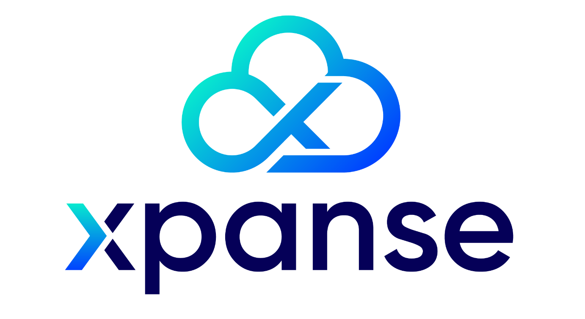

<p align='center'>
<a href="https://github.com/eclipse-xpanse/xpanse/actions/workflows/ci.yml" target="_blank">
    
</a>

 <a href="https://github.com/eclipse-xpanse/xpanse/actions/workflows/coverage.yml" target="_blank">
    
  </a>

<a href="https://opensource.org/licenses/Apache-2.0" target="_blank">
    
  </a>
</p>

Xpanse is an Open Source project allowing to easily implement native-managed service on any cloud service provider. This
project is part of the Open Services Cloud (OSC) charter.

Xpanse unleashes your cloud services by removing vendor lock-in and lock out. It standardizes and exposes cloud service
providers core services, meaning that your xpanse service is portable (multi-cloud) on any cloud topology and provider.
It also avoids tight coupling of your service to other cloud service provider services.

## Configuration Language

Details can be found on the project
website [here](https://eclipse.dev/xpanse/docs/configuration-language).

## Runtime

Details can be found on the project website [here](https://eclipse.dev/xpanse/docs/runtime).

## Database

Details can be found on the project website [here](https://eclipse.dev/xpanse/docs/database).

## Generate terraform-boot client code

1. Run the terraform-boot project with spring-profile `oauth` with methods mentioned here.
   This is necessary even if the terraform-boot will be actually used without oauth enabled in production.
   This will make the client to handle both with and without authentication usecases automatically.
2. Access “http://localhost:9090/v3/api-docs” to get the openapi json.
3. Copy the JSON content and place in [this folder](modules/deployment/src/main/resources/) and
   name the file as 'terraformbootApi.json'.
4. Run the below maven command to generate the REST API client and data models for terraform-boot. The command can be
   executed directly inside the `deployment` module.

```ssh
  mvn clean generate-sources -DskipTerraformBootClientGeneration=false
```

## Generate policy-man client code

1. Run the policy-man project and access “http://localhost:8090/swagger/doc.json” to get the openapi json.
2. Copy the JSON content and place in [this folder](modules/policy/src/main/resources/) and name the file as '
   policy-man-openapi.json'.
3. Run the below maven command to generate the REST API client and data models for policy-man. The command can be
   executed directly inside the `policy` module.

```ssh
  mvn clean generate-sources -DskipPolicyManClientGeneration=false
```

## Static Code Analysis using CheckStyle

This project using `CheckStyle` framework to perform static code analysis. The configuration can be found
in [CheckStyle](checkstyle.xml). The framework also checks the code format in accordance to `Google Java Format`.

The same file can also be imported in IDE CheckStyle plugins to get the analysis results directly in IDE and also to
perform code formatting directly in IDE.

The framework is added as a maven plugin and is executed by default as part of the `verify` phase. Any violations will
result in build failure.

## License/Copyright Configuration

All files in the repository must contain a license header in the format mentioned in [License Header](license.header).

The static code analysis framework will also validate if the license exists in the specified format.

## Sensitive Parameters Handling

The xpanse project involves the use of some sensitive information, such as AK/SK sensitive fields in
credential management, sensitive variable information during service deployment, etc.

* For local development, the AES private key file must exist in the project root path.
* For environments where the application jar is directly executed, The Aes key file (aes_sec) must be
  in the same directory as the project jar file (xpanse-runtime-x.x.x-SNAPSHOT.jar)

#### Generate AES Private Key

AES private key can be generated by any available tools that generate random 256-bit key.

Example: Use https://acte.ltd/utils/randomkeygen to generate the key and copy the value in
Encryption key 256 field to the aes_sec file.

#### AES Private Key File Does Not Exist Or It's Empty

If no AES private key file aes_sec is found in the intended location or if the file is empty, then
no encryption of the sensitive variables will take place. All data will stored in plain text within
the JVM.

## Dependencies File

All third-party related content is listed in the [DEPENDENCIES](DEPENDENCIES) file.
